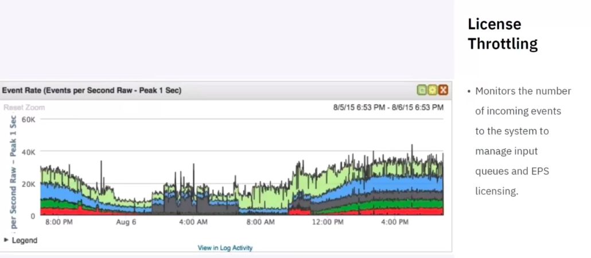

# Security Information and Event Management (SIEM)

#### **Overview of SIEM**

* **Definition**: SIEM is a data aggregator, search, and reporting system that collects logs and security-related information from network environments. It consolidates this data into a readable format, making it accessible for analysis.
* **Purpose**: SIEM systems manage network security by monitoring network flows and events, and they help in identifying security offenses requiring investigation.

#### **Key Concepts**

1. **Log Collection**:
   * Logs are records of events or actions on devices like firewalls or applications.
   * SIEM systems collect these logs for analysis.
2. **Normalization**:
   * The process of transforming raw data into a readable and consistent format.
   * Normalized data is easier for SOC analysts to interpret.
3. **Correlation**:
   * SIEM systems use correlation to establish relationships between different log entries or network events.
   * This helps in identifying patterns that might indicate security threats.
4. **Aggregation**:
   * SIEM consolidates log events and network flow data from various devices.
   * It can pull data in real-time to provide timely analysis.
5. **Reporting**:
   * SIEMs generate reports that summarize the analyzed data, highlighting potential security issues.

#### **Deployment Options**

* **On-Premises**: SIEM can be hosted within an organization's own data center.
* **Cloud**: Accessed via a web browser, SIEM can be hosted in a cloud environment.
* **MSSP (Managed Security Services Provider)**: The SIEM is hosted and managed by a third-party provider.

#### **Events and Flows**

* **Events**: Specific actions logged by devices or applications (e.g., user login, firewall actions).
* **Flows**: Records of network activity between hosts, which can vary in duration depending on the nature of the activity.

#### **Data Collection**

* **Importance**: Real-time data collection enhances the value of SIEM by allowing immediate analysis and quicker detection of anomalies.
* **Considerations**: Factors like CPU, memory, storage capacity, and licensing (measured in Events Per Second (EPS) and Flows Per Minute (FPM)) influence how much data a SIEM can process.

<figure><figcaption></figcaption></figure>

#### **Coalescing**

* **Process**: Events with common attributes are combined into a single event to reduce data noise and simplify analysis.
* **Attributes**: Common attributes include queue ID, source IP, destination IP, destination port, and username.

#### **Offenses**

<figure><figcaption></figcaption></figure>

* **Definition**: Anomalous behaviors that may indicate security threats, such as unusual login patterns.
* **Correlation and Baseline**: Offenses are identified by correlating various data points and comparing them to baseline activity to detect anomalies.
* **Challenge**: Tuning the SIEM to minimize false positives and ensure that the offenses flagged are actionable and not just noise.
